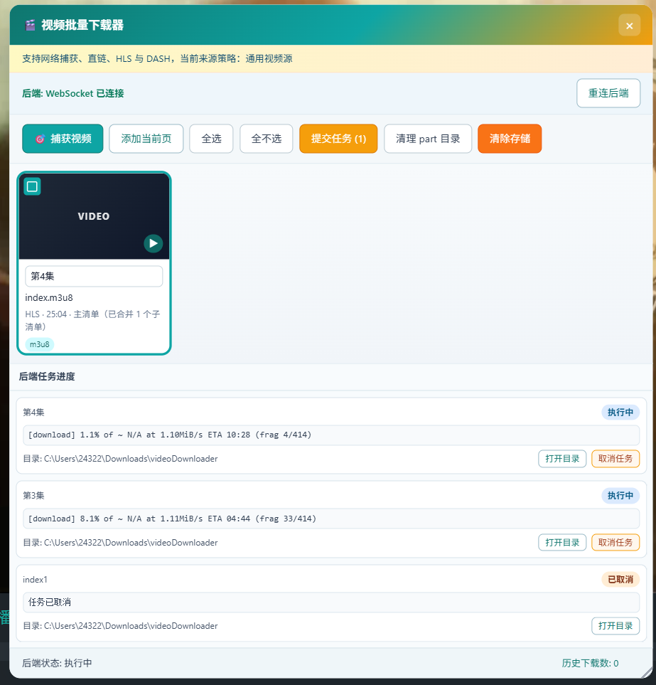

# My Userscripts

一个多入口油猴脚本工程，使用 Vite 作为构建工具，支持多个脚本共享公共模块。

## 包含的脚本

| 脚本 | 功能简介 | 对应的 dist 文件 |
|------|----------|------------------|
| Image Downloader（图片批量下载脚本） | 捕获网页中的图片，支持自动累计、尺寸筛选、原图增强、选择及批量下载 （**webp自动转png/gif，支持抖音表情包动图导出**） | `dist/<前缀>-imageDownloader.user.js` |
| Video Downloader（视频批量下载脚本） | 捕获网页视频信息并提交给本机后端，通过 yt-dlp 批量下载和展示任务进度 | `dist/<前缀>-videoDownloader.user.js` |

`<前缀>` 是构建时自动生成的版本标识。安装时请选择对应脚本前缀最新的 `.user.js` 文件。

---

## Image Downloader（图片批量下载脚本）

批量捕获并下载网页图片，支持所有网站图片下载，支持常见网站原画质图片下载

当前版本：`1.1.2`

### 界面预览


### 核心功能

- **图片捕获** - 获取页面中的 ``、CSS 背景图、懒加载图片等资源，支持**抖音表情包动图导出**
- **自动累计** - 页面滚动或内容变化时继续捕获新图片，自动捕获期间不会移除暂时离开 DOM 的 URL
- **DOM Path 排序** - 按图片的 DOM Path 自然排序，同一容器中的第 2 张会排在第 10 张之前
- **自动重排** - 捕获到新 URL 或已有 URL 的 Path 发生变化时，立即刷新列表顺序
- **尺寸筛选** - 可分别设置图片宽度、高度的最小值和最大值，并选择是否展示尺寸未知的图片
- **自动识别尺寸** - 捕获后以有限并发自动补全背景图、poster、图标等资源的原始像素尺寸，无需滚动到对应缩略图
- **批量下载** - 支持选择多张图片批量下载
- **快捷键** - `Ctrl+Shift+I` 快速唤起图片捕获

### 原图增强
针对以下网站的图片进行优化，自动获取原始大图：

| 网站 | 处理方式 |
|------|---------|
| 哔哩哔哩 | 去除 `@1256w_708h_` 等压缩参数 |
| 字节跳动/抖音 | 去除图片尺寸和质量参数 |
| 微信公众号 | 去除缩略图参数，恢复原图 |
| 小红书 | 域名优化处理 |

### 如何使用？

**只需要一个浏览器扩展：Tampermonkey（油猴）**

使用视频：[Bilibili - 图片下载脚本使用演示](https://www.bilibili.com/video/BV1uNDEB8EDu)

> **重要：** 使用脚本前，请在浏览器的 Tampermonkey 扩展设置中打开「允许用户脚本」选项，否则脚本无法正常运行。

### 第一步：安装 Tampermonkey 扩展

1. **Chrome / Edge 浏览器**
   - 打开 [Chrome 网上应用店](https://chrome.google.com/webstore)
   - 搜索 **Tampermonkey**
   - 点击「添加到 Chrome」

2. **Firefox 浏览器**
   - 打开 [Firefox 附加组件商店](https://addons.mozilla.org)
   - 搜索 **Tampermonkey**
   - 点击「添加到 Firefox」

3. **其他浏览器**
   - 建议使用 Chrome、Edge 或 Firefox
   - 安装完扩展后，浏览器右上角会出现一个🎨图标

### 第二步：安装脚本

可自行上网搜索“如何向Tampermonkey添加脚本”。

**方法一：直接安装（推荐）**

1. 找到 `dist/<前缀>-imageDownloader.user.js` 文件（选择前缀最新的一个）
2. 用浏览器打开这个文件（双击或在浏览器地址栏输入文件路径）
3. 浏览器会提示「Tampermonkey 想知道..."」，点击「继续安装」

**方法二：从文件导入**

1. 点击浏览器右上角的 Tampermonkey 图标
2. 点击「管理面板」
3. 点击左侧「工具」选项
4. 选择「从本地文件导入」
5. 选择 `dist/<前缀>-imageDownloader.user.js` 文件

### 第三步：使用脚本

1. 打开任意包含图片的网页（可以是微博、小红书、B站等）
2. 点击右下角悬浮图标，页面会弹出操作窗口，可移动或缩放大小
3. 点击「捕获图片」按钮（或快捷键`Ctrl + Shift + I`），自动捕获当前页面所有图片
4. 如需持续捕获动态内容，开启「自动捕获」后滚动页面
5. 如需按尺寸过滤，在尺寸筛选栏填写宽高上下限；留空表示不限，也可以选择是否包含未知尺寸图片
6. 点击图片可以选中（选中会显示勾号）
7. 点击「下载选中」按钮开始下载。图片会通过 Tampermonkey 扩展下载；当 Tampermonkey 弹出是否允许下载的提示时，请点击「允许」或「同意」

### 常见问题

Q: 为什么下载的图片是压缩过的？
A: 部分网站会使用 CDN 参数压缩图片。本脚本已内置 B站、抖音、小红书、知乎等网站的增强规则，会自动去除压缩参数获取原图。

Q: 无法下载某些图片？
A: 可能原因：
- 图片跨域限制
- 图片需要登录认证
- 图片是动态加载的（可尝试滚动页面后重新捕获）

Q: 如何下载单个图片？
A: 唤起面板后，只选中该图片，点击下载即可。

Q: 捕获窗口中的图片按照什么顺序排列？
A: 图片按 DOM Path 自然排序。对于同一个 `div` 下的直接 `` 子元素，顺序与其 DOM 中的先后顺序一致，例如第 2 张会排在第 10 张之前。同一个 URL 多次出现时只保留一项，并使用最后扫描到的 Path。


Q: 脚本没有反应怎么办？
A: 请确认：
1. Tampermonkey 扩展已正确安装并启用
2. 脚本在「已安装」列表中显示正常

---

## Video Downloader（视频批量下载脚本）

捕获网页播放器使用的媒体地址，并提交给本机 FastAPI + yt-dlp 后端下载。浏览器脚本负责捕获、选择和展示进度，实际文件由后端写入本机下载目录。

### 界面预览



### 核心功能

- 从页面加载开始捕获 fetch、XHR、Performance 中的媒体请求，并与 video/source、部分 data-*、视频直链合并
- 解析 HLS 主清单与子清单的引用关系，同一视频只展示主清单
- 从播放器的 `blob:` video 元素补充时长、分辨率和封面等元数据
- 支持选择多个视频，前端逐个创建独立下载任务
- 实时显示后端任务状态和进度（WebSocket，失败时自动降级轮询）
- 可将当前播放页直接添加为候选，由 yt-dlp 的站点解析器尝试下载
- 支持任务级透传可读取的 Cookie、Referer 和 User-Agent
- 提交前检查后端下载目录；文件名已存在或有同名任务时显示红色提示并禁止提交
- 快捷键 `Ctrl+Shift+V` 快速捕获

### 使用前准备

需要安装：

1. Tampermonkey 浏览器扩展。
2. Python 3，并确保 `python` 命令可用。
3. FFmpeg（推荐）。DASH/MPD 和部分站点的视频、音频分轨需要 FFmpeg 合并，可用 `ffmpeg -version` 检查。

### 第一步：安装视频用户脚本

1. 构建脚本，或直接使用 `dist/` 中最新生成的 `????-videoDownloader.user.js`。
2. 用浏览器打开该文件，并在 Tampermonkey 中确认安装。
3. 更新脚本后，需要刷新已经打开的视频页面；网络捕获器在页面加载开始时安装。

自动构建前缀固定为 4 个字符，例如 `ecqj-videoDownloader.user.js`。

### 第二步：启动本机后端

默认地址为 `http://127.0.0.1:8787`，WebSocket 地址为 `ws://127.0.0.1:8787`。

Windows PowerShell：

```powershell
cd src\scripts\videoDownloader\backend
powershell -NoProfile -ExecutionPolicy Bypass -File .\start_backend.ps1
```

首次运行会自动创建 `.venv`、安装依赖，并从 `.env.example` 生成 `.env`。后续确认依赖没有变化时可以跳过依赖检查：

```powershell
.\start_backend.ps1 -SkipDependencyInstall
```

Linux、macOS、Git Bash 或 WSL：

```bash
cd src/scripts/videoDownloader/backend
python -m venv .venv
source .venv/bin/activate
pip install -r requirements.txt
cp .env.example .env
python app/main.py
```

下载目录由 `.env` 控制，默认配置为：

```dotenv
VD_BACKEND_DOWNLOAD_ROOT=~/Downloads/videoDownloader
```

修改 Python 后端代码或 `.env` 后需要停止并重新启动后端。看到 `Uvicorn running on http://127.0.0.1:8787` 表示启动成功。

### 第三步：捕获并下载视频

1. 先启动后端，再打开或刷新视频页面。
2. 开始播放视频，等待播放器显示时长；这样更容易捕获真实清单并补全时长等信息。
3. 点击右下角悬浮按钮打开面板。
4. 点击“捕获视频”，或按 `Ctrl+Shift+V`。脚本会同时检查当前页面及其 frame。
5. 如果显示“主清单（已合并 N 个子清单）”，说明脚本识别出同一 HLS 视频的主/子清单，只需提交主清单。
6. 在文件名输入框中填写最终文件名，不需要扩展名。若后端已有同名文件或同名任务，输入框会变红，必须修改名称后才能提交。
7. 选择一个或多个候选项，点击“提交任务”。每个候选项会创建一个独立任务。
8. 在“后端任务进度”区域查看进度、取消任务或打开下载目录。

如果网络捕获没有找到可用地址，可以点击“添加当前页”，让 yt-dlp 尝试直接解析当前站点页面。

### 支持哪些视频

| 类型 | 支持情况 | 说明 |
|------|----------|------|
| HLS / m3u8 | 支持 | 可识别主清单和已捕获的子清单关系；提交主清单后由 yt-dlp 选择可用画质和音轨 |
| DASH / MPD | 支持 | 视频和音频通常分轨，建议安装 FFmpeg 进行合并 |
| 视频直链 | 支持 | 支持 `mp4`、`webm`、`m4v`、`mov`、`mkv`、`avi`、`flv`、`ts` 等常见格式 |
| MIME 识别的动态地址 | 部分支持 | URL 没有扩展名时，可根据响应的 `Content-Type` 识别视频或清单 |
| yt-dlp 支持的站点页面 | 尝试支持 | 使用“添加当前页”；最终结果取决于当前 yt-dlp 版本、登录状态和站点变化 |

“支持”表示脚本存在相应下载路径，不代表所有网站都一定可以下载。站点登录、Cookie、防盗链、地区限制、验证码和接口变更都可能影响结果。

### 文件名和任务规则

- 后端任务 ID 使用独立 UUID，与输出文件名无关。
- 下载目录已存在相同文件名（不区分大小写）时，后端拒绝创建任务，不会覆盖文件，也不会自动追加 `_2`、`_3`。
- 有同名未结束任务时同样拒绝创建。前端会提前检查并以红色输入框提示；后端在正式创建任务时会再次检查，避免并发冲突。
- 每个后端任务只包含一个视频；前端批量提交时会依次创建多个任务。

### 当前限制

- `blob:` 本身无法提交后端；脚本会尝试捕获其背后的 m3u8、MPD 或完整视频请求
- 只发现 TS/M4S 分片时仅显示汇总提示，不会将单个分片作为视频下载
- DRM 受保护视频通常无法通过常规方式下载
- 部分站点可能依赖 HttpOnly Cookie，前端无法直接读取
- 平台私有接口或加密响应中的音视频轨地址不一定能够识别
- 直播或播放器尚未加载完成时可能没有固定时长；HLS 清单本身通常也不包含封面
- 如 HTTPS 页面阻断本机 HTTP/WS，请切到 HTTPS/WSS 后端

### 常见问题

Q: 面板显示“后端未连接”怎么办？

A: 确认后端窗口仍在运行，访问地址和端口与 `src/shared/config.js` 一致，然后点击“重连后端”。

Q: 为什么捕获到多个 `index.m3u8`？

A: HLS 播放器可能依次请求主清单和具体画质的子清单。能够从清单正文确认父子关系时，脚本会合并显示；无法证明关系的同名 URL 会保留，避免误合并不同视频。

Q: 为什么文件名输入框变红？

A: 下载目录已有同名文件，或当前存在同名未结束任务。请修改文件名；后端不会覆盖或自动改名。

Q: 为什么有时长但没有封面？

A: 时长通常来自 `<video>` 播放元数据，而 HLS/DASH 清单通常不包含封面。网站如果使用独立图片或 CSS 背景显示封面，也可能无法自动关联。

---

## 📋 项目结构

## 目录结构

```
my-userscripts/
├── src/
│   ├── scripts/           # 各脚本的入口文件
│   │   ├── imageDownloader/    # 图片批量下载器
│   │       ├── main.js         # 脚本主入口
│   │       ├── imageCapture.js # 页面图片和 DOM Path 捕获
│   │       ├── imageCollection.js # URL 累计、更新和排序
│   │       ├── autoCapture.js  # 自动捕获触发控制
│   │       └── imageEnhancers.js  # 原图增强规则
│   │   └── videoDownloader/    # 视频捕获前端及本机后端
│   │       ├── main.js         # 用户脚本主入口
│   │       ├── networkMediaCapture.js # 网络媒体和 HLS 清单捕获
│   │       ├── videoSelector.js # 视频选择及文件名检查 UI
│   │       └── backend/        # FastAPI + yt-dlp 后端
│   │
│   ├── shared/            # 共享模块（所有脚本共用）
│   │   ├── config.js      # 全局配置
│   │   ├── dom.js         # DOM 操作工具
│   │   ├── request.js     # 网络请求封装
│   │   ├── storage.js     # 存储工具
│   │   └── logger.js      # 日志工具
│   │
│   └── styles/            # 共享样式
│       ├── common.css     # 通用样式
│       └── popup.css      # 弹窗样式
│
├── dist/                  # 打包输出目录，保留历次构建
│   ├── <前缀>-imageDownloader.user.js  # 图片脚本产物
│   └── <前缀>-videoDownloader.user.js  # 视频脚本产物
│
├── package.json           # 项目配置
├── vite.config.js         # Vite 构建配置
└── README.md              # 本文档
```

## 目录说明

### `src/scripts/imageDownloader/`

图片批量下载器的核心代码。

| 文件 | 说明 |
|------|------|
| main.js | 脚本主入口，负责初始化和调用共享模块 |
| imageCapture.js | 捕获页面图片并生成 DOM Path |
| imageCollection.js | 按 URL 管理图片集合并按 DOM Path 自然排序 |
| autoCapture.js | 监听页面滚动和内容变化，调度自动扫描 |
| imageEnhancers.js | 原图增强规则配置 |

### `src/shared/`

存放各脚本共享的工具模块。

| 模块 | 说明 |
|------|------|
| config.js | 全局配置项（API地址、日志级别等） |
| dom.js | DOM 操作工具（等待元素、创建元素等） |
| request.js | 基于 GM_xmlhttpRequest 的请求封装 |
| storage.js | 基于 GM_setValue 的存储封装 |
| logger.js | 分级日志工具（debug/info/warn/error） |

### `src/styles/`

共享的 CSS 样式文件。

| 文件 | 说明 |
|------|------|
| common.css | 通用样式（按钮、输入框、卡片等） |
| popup.css | 弹窗相关样式 |

### `dist/`

打包输出的目录，包含可直接安装到 Tampermonkey 的 `.user.js` 文件。

## 打包命令

### 安装依赖

```bash
npm install
```

### 开发模式

监听文件变化自动重新打包：

```bash
npm run dev
```

如需监听视频脚本：

```bash
npm run dev:video
```

videoDownloader 需要配合本机后端运行：

Windows：

```powershell
cd src\scripts\videoDownloader\backend
.\start_backend.ps1
```

Windows 打包本机后端：

```powershell
.\package.ps1
```

Linux/macOS/Git Bash/WSL：

```bash
cd src/scripts/videoDownloader/backend
python -m venv .venv
source .venv/bin/activate
pip install -r requirements.txt
cp .env.example .env
python app/main.py
```

### 生产打包

只构建图片或视频脚本：

```bash
npm run build:image
npm run build:video
```

构建全部脚本：

```bash
npm run build
```

该命令会按脚本逐个打包，确保每个 userscript 都是单文件产物。
每次构建会生成一个 4 位的 Base36 时间前缀，不覆盖不同前缀的已有产物。
产物默认不压缩，保留正常的 JavaScript 换行和缩进，便于检查与调试。

打包后的文件会输出到：
- `dist/<前缀>-imageDownloader.user.js`
- `dist/<前缀>-videoDownloader.user.js`

两者都可直接安装使用。

说明：不会依赖 `dist/assets` 共享 chunk。如需手动指定前缀，可使用
`BUILD_PREFIX=my1 npm run build:image`；自定义前缀只能包含字母、数字、下划线和连字符。

## 添加新增强规则

如需添加新的网站原图增强规则，修改 `src/scripts/imageDownloader/imageEnhancers.js`：

```javascript
registerEnhancer({
  name: 'example-site',      // 规则名称（唯一标识）
  priority: 10,               // 优先级（数字越大优先级越高）
  urlPattern: /example\.com/i,  // 匹配图片 URL 的正则表达式
  enhance(url) {
    // 处理函数：接收原 URL，返回增强后的 URL
    return url
      .replace(/&width=[^&]*/, '')
      .replace(/&quality=[^&]*/, '');
  },
});
```

### 规则属性说明

| 属性 | 类型 | 说明 |
|------|------|------|
| name | string | 规则名称（唯一标识） |
| urlPattern | RegExp | 匹配图片 URL 的正则表达式 |
| enhance | function | 处理函数，接收原 URL，返回增强后的 URL |
| priority | number | 优先级（数字越大优先级越高，可选） |

## 使用共享模块

在脚本中按以下方式导入共享模块：

```javascript
import { config } from '../shared/config.js';
import { waitForElement, createElement } from '../shared/dom.js';
import { get, post } from '../shared/request.js';
import { getItem, setItem } from '../shared/storage.js';
import { logger } from '../shared/logger.js';
```

## 注意事项

- 共享模块依赖 Tampermonkey 的 GM_* API
- 打包后的文件头部会自动注入元数据信息
- 样式文件需要在脚本中手动引入或通过 GM_addStyle 注入


